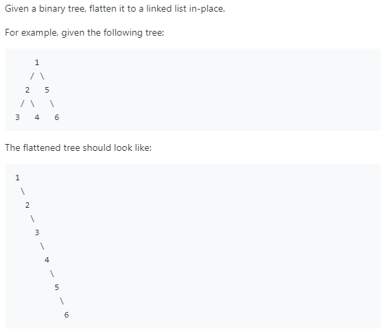

# [114. Flatten Binary Tree to Linked List](https://leetcode.com/problems/flatten-binary-tree-to-linked-list/)

## Problem



## Solution
* 思路： 找出一个这样的规律：情况1：一个父节点有左孩子和右孩子，找到该父节点的左孩子的最右节点，将父节点右孩子作为这个最右节点的右孩子，接着将父节点的左孩子变为右孩子，将左孩子置空。情况2：一个父节点有左孩子没有右孩子，则直接将父节点的左孩子变为右孩子，将左孩子置空。情况3：一个父节点只有右孩子，则不需要做任何事。按先序遍历去判断每个节点的以上三种情况。
* 代码：
```
/**
 * Definition for a binary tree node.
 * struct TreeNode {
 *     int val;
 *     TreeNode *left;
 *     TreeNode *right;
 *     TreeNode() : val(0), left(nullptr), right(nullptr) {}
 *     TreeNode(int x) : val(x), left(nullptr), right(nullptr) {}
 *     TreeNode(int x, TreeNode *left, TreeNode *right) : val(x), left(left), right(right) {}
 * };
 */
class Solution {
public:
    TreeNode* findRight(TreeNode* node){
        TreeNode* tmp = node;
        while (tmp->right)
            tmp=tmp->right;
        return tmp;
    }
    void flatten(TreeNode* root) {
        if (root==nullptr)
            return;
        
        flatten(root->left);
        flatten(root->right);
        if (root->left != nullptr){
            if (root->right != nullptr){
                TreeNode *most_right = findRight(root->left);
                most_right->right = root->right;
            }
            root->right = root->left;
            root->left = nullptr;
        }
        
    }
};
```