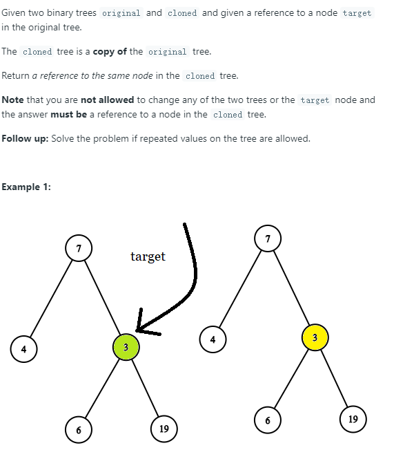

# [1379. Find a Corresponding Node of a Binary Tree in a Clone of That Tree](https://leetcode.com/problems/find-a-corresponding-node-of-a-binary-tree-in-a-clone-of-that-tree/)

## Problem



## Solution
* 思路：对两棵树进行相同的遍历操作，如层序遍历，当遍历到original树的target节点时，即找到了clone树的节点。
* 代码
```
/**
 * Definition for a binary tree node.
 * struct TreeNode {
 *     int val;
 *     TreeNode *left;
 *     TreeNode *right;
 *     TreeNode(int x) : val(x), left(NULL), right(NULL) {}
 * };
 */

class Solution {
public:
    TreeNode* getTargetCopy(TreeNode* original, TreeNode* cloned, TreeNode* target) {
        queue<TreeNode*> o_q;
        queue<TreeNode*> c_q;
        
        
        o_q.push(original);
        c_q.push(cloned);
        while(!o_q.empty()){
            TreeNode* h1 = o_q.front();
            TreeNode* h2 = c_q.front();
            if (h1 == target){
                return h2;
            }
            
            o_q.pop();
            c_q.pop();
            if (h1->left){
                o_q.push(h1->left);
                c_q.push(h2->left);
            }
            if (h1->right){
                o_q.push(h1->right);
                c_q.push(h2->right);
            }
            
        }
        return NULL;
    }
};
```