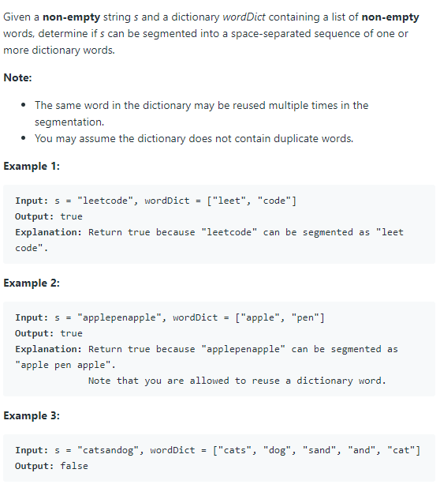

# [139. Word Break](https://leetcode.com/problems/word-break/)

## Problem


## Solution
* 思路：暴力搜索。（1）从wordDict中依次取出单词，看字符串s的前n个字符是否与该单词相等。（2）若相等则将s剩余的字符串重复（1）的步骤，直至一些条件不符合退出。利用一个哈希表记录已经匹配过的字符串是否能在wordDict中找到。
* 代码：
```
class Solution {
public:
    unordered_map<string, bool> m;
    bool wordBreak(string s, vector<string>& wordDict) {
        if (m.count(s))
            return m[s];
        
        for (size_t i=0; i<wordDict.size(); i++){
            int word_size = wordDict[i].size();
            if (word_size > s.size())
                continue;
            if (s.substr(0, word_size) == wordDict[i]){
                if (s.size() == word_size){
                    m[s] = true;
                    return true;   
                }
                if (wordBreak(s.substr(word_size), wordDict)){
                    m[s.substr(word_size)]=true;
                    return true;
                }
            }
        }
        m[s] = false;
        return false;
    }
};
```