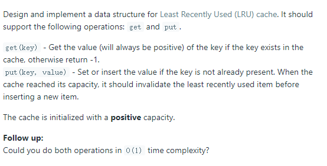

# [146. LRU Cache](https://leetcode.com/problems/lru-cache/)

## Problem

## Solution
* 思路：要实现一个高效的LRU缓存，可以用双向链表来存储kv数据，用一个Hash表来存储每个key对应于双向链表中的指针。这样每次查询是从Hash表查找相应的key，获取其对应指针得到最后的value结果，该操作时间复杂度是O(1)。由于Hash表保存了链表元素的指针信息，所以对链表的插入删除操作都可以做到O(1)的时间复杂度。
* 技巧：`list.splice()`函数可以修改迭代器在链表中的位置。
* 代码
```
class LRUCache {
private:
	unordered_map<int, list<pair<int, int>>::iterator> table_;
	list<pair<int, int>> lru_;
	int capacity_;
public:
	LRUCache(int capacity) {
		capacity_ = capacity;
	}

	int get(int key) {
		auto it = table_.find(key);
		if (capacity_ && it != table_.end()) {
			lru_.splice(lru_.begin(), lru_, it->second);
			return it->second->second;
		}
		else {
			return -1;
		}
	}

	void put(int key, int value) {
		// 遇到重复的key，要先删掉就的key，然后再插入新的key。
		auto it = table_.find(key);
		if (it != table_.end()) {
			lru_.erase(it->second);
			table_.erase(it);
		}
		if (capacity_ && lru_.size() >= capacity_) {
			table_.erase(table_.find(lru_.back().first));
			lru_.pop_back();
		}
		lru_.emplace_front(key, value);
		table_[key] = lru_.begin();

	}
};

/**
 * Your LRUCache object will be instantiated and called as such:
 * LRUCache* obj = new LRUCache(capacity);
 * int param_1 = obj->get(key);
 * obj->put(key,value);
 */
```