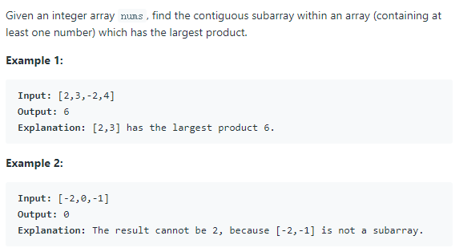

# [152. Maximum Product Subarray](https://leetcode.com/problems/maximum-product-subarray/)
## Problem



## Solution
* 思路：动态规划题，参考[题解](https://www.cnblogs.com/grandyang/p/4028713.html)。主要思路是：数组中含有正数、负数和0。最大正数值乘以一个负数会变成最小值，反之亦然。所以记录两个变量，一个变量max_p表示子数组 [0, i] 范围内且包含 nums[i] 数字的最大子数组乘积，另一变量min_p表示子数组 [0, i] 范围内且包含 nums[i] 数字的最小子数组乘积。此时的最大值和最小值只会在这三个数字之间产生`nums[i+1], max(max_p * nums[i+1], tmp_min*nums[i+1])`，由于存在0的可能，需要不断更新每轮比较的结果得到最终的最大值。
* 代码:
```
class Solution {
public:
    int maxProduct(vector<int>& nums) {
        if (nums.size() == 0)
            return 0;
        int res = nums[0], max_p = nums[0], min_p = nums[0];
        for (int i=1; i<nums.size(); i++){
            int tmp_max = max_p, tmp_min = min_p;
            max_p = max(nums[i], max(tmp_max * nums[i], tmp_min*nums[i]));
            min_p = min(nums[i], min(tmp_max * nums[i], tmp_min*nums[i]));
            // 每轮都需要更新res。
            res = max(max_p, res);
        }
        return res;
    }
};
```
