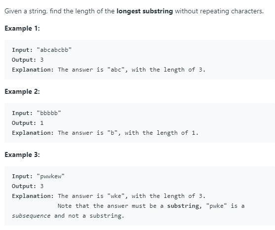

# [3. Longest Substring Without Repeating Characters](https://leetcode.com/problems/longest-substring-without-repeating-characters/)

## Problem




## Solution

* 思路：同样使用双指针技巧，定义left和right指针。（1）右移right指针，利用哈希表存储字符串S[left, right]的字符。（2）若哈希表中的字符存在重复，则左移left指针，直至哈希表中不存在重复字符。依次循环（1）（2）步骤，直至right指针遍历完字符串S。

* 代码：

```
class Solution {
public:
    int lengthOfLongestSubstring(string s) {
        unordered_map<char, int> m;
        int res = 0;
        int left=0, right=0;
        while (right < s.size()){
            char c = s[right];
            m[c]++;
            
            while(m[c] > 1){
                char d = s[left];
                left++;
                m[d]--;
            }
            right++;
            res = max(res, right-left);
            
        }
        return res;
    }
};
```
