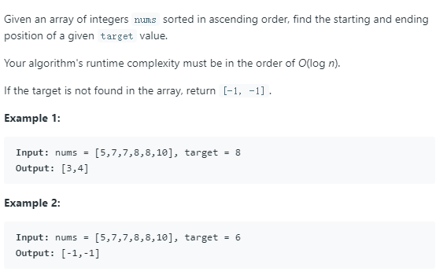

# [34. Find First and Last Position of Element in Sorted Array](https://leetcode.com/problems/find-first-and-last-position-of-element-in-sorted-array/)

## Problem



## Solution 1
* 思路： 题目要求寻找特定元素在数组中首次出现和最后出现的位置。可以先用二分查找法找到特定元素在数组出现的位置，然后从该位置分别向前和向后继续用二分法查找首次出现和最后出现的位置。
* 技巧：本题主要考察二分查找法的写法。
1. 当需要查找**首次**出现元素的位置时，用以下的写法：
```
int left_bound(int[] nums, int target) {
    int left = 0, right = nums.length - 1;
    while (left <= right) {
        int mid = left + (right - left) / 2;
        if (nums[mid] < target) {
            left = mid + 1;
        } else if (nums[mid] > target) {
            right = mid - 1;
        } else if (nums[mid] == target) {
            // 别返回，锁定左侧边界
            right = mid - 1;
        }
    }
    // 最后要检查 left 越界的情况
    if (left >= nums.length || nums[left] != target)
        return -1;
    return left;
}


要点:
1.查找的范围是两端闭合[left, right]，所以循环条件是left <= right。
2.当nums[mid]==target时，收缩右边界，right = mid-1。由于while退出的条件是left == right+1，所以若mid是首次出现的元素，则退出循环时，left==right+1==mid-1+1==mid，即left位置就是mid首次出现元素的位置；若mid不是首次出现的位置，每次nums[mid]==target，都会收缩右边界，直至mid走到首次位置。
3.最后注意检查left越界情况。
```
2.  当需要查找**最后**出现元素的位置时，用以下的写法：
```
int right_bound(int[] nums, int target) {
    int left = 0, right = nums.length - 1;
    while (left <= right) {
        int mid = left + (right - left) / 2;
        if (nums[mid] < target) {
            left = mid + 1;
        } else if (nums[mid] > target) {
            right = mid - 1;
        } else if (nums[mid] == target) {
            // 别返回，锁定右侧边界
            left = mid + 1;
        }
    }
    // 最后要检查 right 越界的情况
    if (right < 0 || nums[right] != target)
        return -1;
    return right;
}

要点：
1.与上述逻辑相似，注意当nums[mid]==target时，增大左边界，所以返回的是right，right==left-1==mid；最后检查right的越界情况。
```
* 该题代码如下：
```
class Solution {
public:
    int func(const vector<int>& nums, int target, int left, int right, int flag){
        // flag: 1 find left, 0 find right
        while (left <= right){
            int mid = left + (right -left) / 2;
            if (nums[mid] < target){
                left = mid + 1;
            }else if (nums[mid] > target){
                right = mid - 1; 
            }else if (nums[mid] == target){
                if (flag){
                    right = mid -1;
                }else{
                    left = mid + 1;
                }
            }
        }
        if (flag){
            if (left >= nums.size() || nums[left]!=target)
                return -1;
            else{
                return left;
            }
         }else{
            if (right < 0 || nums[right]!=target){
                return -1;
            }else{
                return right;
            }
        }
        
    }
    vector<int> searchRange(vector<int>& nums, int target) {
        int left = 0, right = nums.size()-1;
        vector<int> res = {-1, -1};
        while (left <= right){
            int mid = left + (right -left) / 2;
            if (nums[mid] < target){
                left = mid + 1;
            }else if (nums[mid] > target){
                right = mid - 1; 
            }else if (nums[mid] == target){
            	// 当找到特定元素后，向前和向后继续二分查找
                res[0] = func(nums, target, left, mid, 1);
                res[1] = func(nums, target, mid, right, 0);
                return res;
    
            }
            
        }
        return res;
    }
};
```