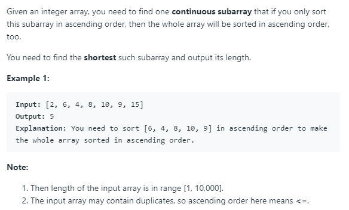

# [581. Shortest Unsorted Continuous Subarray](https://leetcode.com/problems/shortest-unsorted-continuous-subarray/)

## Problem


## Solution
* 思路：要寻找数组中第一个不符合排序规定的位置和最后一个不符合排序规定的位置。可以使用一个栈，从头开始遍历数组，把顺序排序的元素的坐标依次压入栈。假设遇到不符合排序规定的元素A，即小于栈顶索引的元素，就弹出栈顶，直至栈顶索引的元素小于A，记录最后一个栈顶弹出的坐标。最后取所有这些记录坐标的最小值，得到第一个不符合排序规定的位置。同理，从后往前遍历数组，找到最后一个不符合排序规定的位置。
* 代码：
```
class Solution {
public:
    int findUnsortedSubarray(vector<int>& nums) {
        stack<int> s;
        int l = nums.size(), r = 0;
        for (int i=0; i< nums.size(); i++){
            while(!s.empty() && nums[s.top()] > nums[i]){
                l = min(l, s.top());
                s.pop();
            }
            s.push(i);
        }
        for (int i=nums.size()-1; i>=0;i--){
            while(!s.empty() && nums[s.top()] < nums[i]){
                r = max(r, s.top());
                s.pop();
            }
            s.push(i);
        }
        return r - l >0?r-l+1:0;
        
    }
};
```