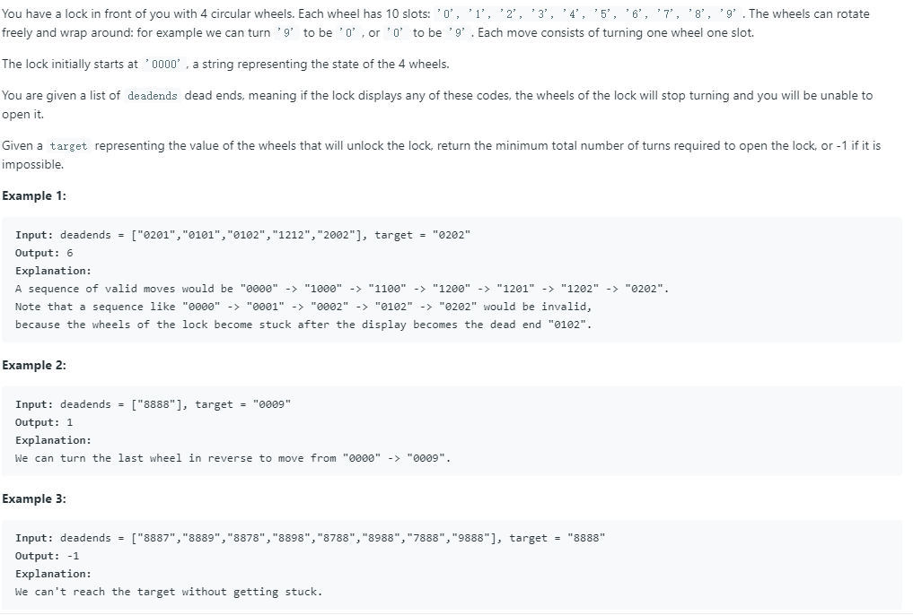

# [752. Open the Lock](https://leetcode.com/problems/open-the-lock/)

## Problem



## Solution1

* 思路：因为共四位密码，每次转动能将其中一位往上或往下转，因此每次转动共有8种可能。利用**BFS算法**的思想，用队列记录每次转动的8种可能，然后依次出队检查出队的元素是否符合要求或是否在死锁集合范围内。若都不符合，则入队该元素转动的8种可能，继续下一轮操作。
* 代码：

```
class Solution {
public:
    string plusOne(string s, int j){
        if (s[j] == '9')
            s[j] = '0';
        else
            s[j] += 1;
        return s;
    }
    string minusOne(string s, int j){
        if (s[j] == '0')
            s[j] = '9';
        else
            s[j] -= 1;
        return s;
    }
    int openLock(vector<string>& deadends, string target) {
        unordered_set<string> deads;
        for (auto s: deadends){
            deads.insert(s);
        }
        unordered_set<string> visited;
        queue<string> q;
        q.push("0000");
        visited.insert("0000");
        int step = 0;
        while (!q.empty()){
            int sz = q.size();
            // 出队当前队列的所有节点，所以step只需加1，即能表示一轮操作。
            for (int i=0; i<sz; i++){
                string s = q.front();
                q.pop();
                if (deads.count(s))
                    continue;
                if (s == target)
                    return step;
                
                for (int j=0; j<4; j++){
                    string up = plusOne(s, j);
                    if (!visited.count(up)){
                        q.push(up);
                        visited.insert(up);
                    }
                    string down = minusOne(s, j);
                    if (!visited.count(down)){
                        q.push(down);
                        visited.insert(down);
                    }
                }
            }
            step++;
        }
        return -1;
        
    }
};
```

## Solution2

* 思路：由于知道了初始状态和目标状态，可以使用双向BFS，加快搜寻速度。
* 代码：

```
class Solution {
public:
    string plusOne(string s, int j){
        if (s[j] == '9')
            s[j] = '0';
        else
            s[j] += 1;
        return s;
    }
    string minusOne(string s, int j){
        if (s[j] == '0')
            s[j] = '9';
        else
            s[j] -= 1;
        return s;
    }
    int openLock(vector<string>& deadends, string target) {
        unordered_set<string> deads;
        for (auto s: deadends){
            deads.insert(s);
        }
        unordered_set<string> visited;
        unordered_set<string> top_q;
        unordered_set<string> bottom_q;
        top_q.insert("0000");
        bottom_q.insert(target);
        visited.insert("0000");
        visited.insert(target);
        int top_step = 0;
        int bottom_step = 0;
        while (!top_q.empty() && !bottom_q.empty()){
            unordered_set<string> top_tmp;
            unordered_set<string> bottom_tmp;
            
            for (auto s: top_q){
                if (deads.count(s))
                    continue;
                for (int j=0; j<4; j++){
                    string up = plusOne(s, j);
                    if (bottom_q.count(up))
                        return top_step+bottom_step+1;
                    if (!visited.count(up)){
                        top_tmp.insert(up);
                        visited.insert(up);
                    }
                    string down = minusOne(s, j);
                    if (bottom_q.count(down))
                        return top_step+bottom_step+1;
                    if (!visited.count(down)){
                        top_tmp.insert(down);
                        visited.insert(down);
                    }
                }
            }
            top_q = top_tmp;
            top_step++;
            for (auto s: bottom_q){
                if (deads.count(s))
                    continue;
                for (int j=0; j<4; j++){
                    string up = plusOne(s, j);
                    if (top_q.count(up))
                        return top_step+bottom_step+1;
                    if (!visited.count(up)){
                        bottom_tmp.insert(up);
                        visited.insert(up);
                    }
                    string down = minusOne(s, j);
                    if (top_q.count(down))
                        return top_step+bottom_step+1;
                    if (!visited.count(down)){
                        bottom_tmp.insert(down);
                        visited.insert(down);
                    }
                }
            }
            bottom_q = bottom_tmp;
            bottom_step++;
        }
        return -1;
        
    }
};
```