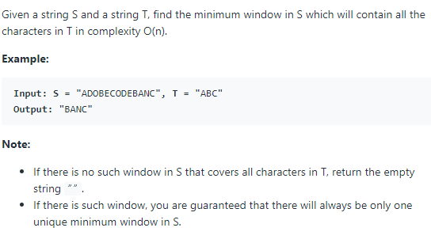

# [76. Minimum Window Substring](https://leetcode.com/problems/minimum-window-substring/)

## Problem



## Solution
* 思路：主要使用**双指针技巧**。首先右移right增大匹配区间，当满足要求后，左移left缩小空间。具体做法：首先用need哈希表统计需要匹配的子串T，接着（1）右移right指针，并用window哈希表去统计S串中[left，right)区间的字符。（2）若此时window哈希表中的字符满足need条件，则开始左移left指针缩小匹配空间。持续循环（1）（2）操作，直至遍历完整个S串。
* 具体代码如下：
```
class Solution {
public:
    string minWindow(string s, string t) {
        unordered_map<char, int> need, window;
        for (char c: t) need[c]++;
        
        int left = 0, right = 0;
        int valid = 0;
        int start=0, len=s.size()+1;
        while(right < s.size()){
            char c = s[right];
            right++;
            if (need.count(c)){
                window[c]++;
                if (window[c] == need[c])
                    valid++;
            }
            while (valid == need.size()){
                if (right - left < len){
                    start = left;
                    len = right - left;
                }
                char d = s[left];
                left++;
                if (need.count(d)){
                    if (window[d] == need[d])
                        valid--;
                    window[d]--;
                }
            }
        }
        return len == (s.size()+1) ? "":s.substr(start, len);
    }
};
```

