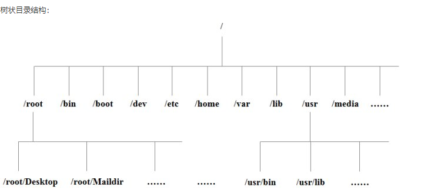

# 《Linux教程》

## 系统相关要点
* 不管是重启系统还是关闭系统，首先要运行 sync 命令，把内存中的数据写到磁盘中。
* 系统目录结构

## linux文件内容查看命令
* cat  由第一行开始显示文件内容
* tac  从最后一行开始显示，可以看出 tac 是 cat 的倒着写！
* nl   显示的时候，顺道输出行号！
* more 一页一页的显示文件内容
* less 与 more 类似，但是比 more 更好的是，他可以往前翻页！
* head 只看头几行
* tail 只看尾巴几行； `tail -f`: 持续侦测，可以用来侦测log信息。
## linux磁盘管理
* df: 列出**文件系统**的整体磁盘使用量。
* du: 列出**文件/目录**的磁盘空间使用量。
* fdisk: 磁盘分区。

## vim使用
* 光标移动

* 执行命令： `:! commmd`
## Shell脚本
* 第一行一般写`#!/bin/bash`，告诉系统这个脚本需要什么解释器来执行。
* 运行时，一般写成`./test.sh`，而不是 `test.sh`，直接写 `test.sh`，linux 系统会去 PATH 里寻找有没有叫 test.sh 的，所以写成 `test.sh `会找不到命令，要用 `./test.sh` 告诉系统说，就在当前目录找。
* `echo -e 开启转义`
* `test`命令用于检测某个条件是否成立。
###  变量：
	1. 定义变量时，变量名不加$，如`your_name="runoob.com"`，且变量名和等号之间不能有空格。
	2. 使用一个定义过的变量，只要在变量名前面加$，或者${变量名}。
	3. `readonly` 命令可以将变量定义为只读变量。
	4. `unset`命令可以删除变量。
* 字符串：
1. 可以使用单引号或双引号。单引号里的字符串按原样输出，变量无效，且不能出现单独的一个单引号（转移也不行）；双引号里的字符串可以有变量和转移字符。
2.  获取字符串的长度，`${#变量名}`；提取子字符串`${变量名:1:4}`。
* 数组：
1.  bash支持一维数组，用括号来表示数组，数组元素用"空格"符号分割开。
2.  读取数组元素：`${数组名[下标]}`；获取数组所有元素：`${数组名[@]}`
3.  获取数组长度：`${#数组名[*]}`
### 传递参数：
1. 脚本内获取传入的参数： `$n`，其中`$0`为执行的文件名。
2. 特殊字符

### 基本运算符
* 算术运算符，表达式和运算符之间要有空格，例如 2+2 是不对的，必须写成 2 + 2；完整的表达式要被反引号包含。如`` `expr $a + $b` ``
* 条件表达式要放在方括号之间，并且要有空格，例如: `[$a==$b]` 是错误的，必须写成 `[ $a == $b ]`。
### 流程控制
* if作用范围：if ---- fi
* for/while作用范围：do -----done
* case作用范围：case ---- esac，每个case分支用右圆括号，用两个分号表示break。
### 输入/输出重定向
1. 重定向命令：

2. `/dev/null` 是一个特殊的文件，写入到它的内容都会被丢弃；`command > /dev/null 2>&1` 一般这样写屏蔽标准输出和标准错误输出。

## 常用命令
* 需要时可以查[link](https://www.w3cschool.cn/linux/linux-command-manual.html).

