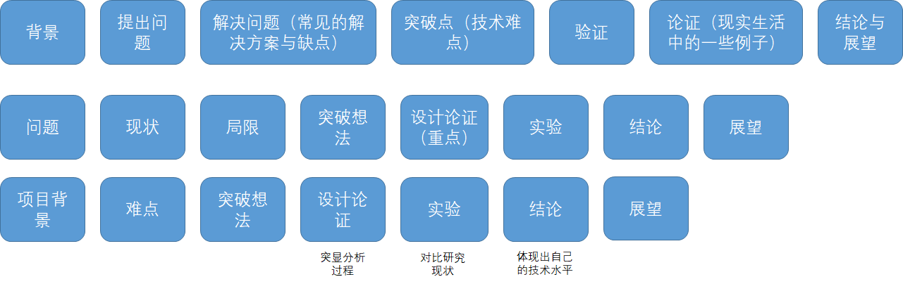

# Notes

## The Key To Accelerating Your Coding Skills
阅读心得，学习编程的过程中，会有一个转折点（the inflection point），过了这个转折点后，就能起飞。以下是自己总结度过转折点的方法。

1. 在初始阶段要认真编程，学会去解决特定的问题。当解决的问题多了，自然能融会贯通。
2. 在初始阶段要认真对待细节，如详细阅读文档，学会debug错误。其中对待出现的bug，要学会阅读和总结bug。
3. 一直阅读教程没法走得更远，只有当遇到没出现过的问题，并通过自己亲自去解决，才能得到成长。
4. 当遇到瓶颈时，可以慢下来思考。
5. 每天都要突破自己一点，走出舒适区。
6. 对于WEB开发者，有两个学习的关键点：学好CRUD，熟悉网络开发框架和数据结构。
7. 不要追逐热点。
8. 尝试一些课程范围外的工作。
9. 转折点的最后阶段是接纳，接受开发是一个持续学习的过程。

## B站技术胖视频
* 自学四条经验：
	1.制定学习计划
	2.设定时间表
	3.找一位老师
	4.至少完成一个完整的项目
* 提高代码质量
	1. 看《代码大全》《代码整洁知道》
	2. 测试驱动开发，先写测试代码，在写业务逻辑。
	3. 工匠精神，重构代码。
	4. code review。
* 跨过一些坑
	1. git版本打tag
	2. 每天要提交代码。
	3. 分批持续集成
	4. 撰写至少3种文档：（1）程序设计文档【程序员写】（2）数据结构文档【后端或DBA写】（3）使用说明文档【测试或产品经理写】
* 十步学习法
	1.了解全局知识
	2.确定学习范围
	3.定义学习目标
	4.寻找资源
	5.创建学习计划
	6.筛选资源
	7.开始学习，浅尝辄止
	8.动手操作，边学边玩
	9.全面掌握，学以致用
	10.了为人师，融会贯通
* 注意陷阱
	1. 追求广度，没有宽度
	2. 代码行数论英雄
	3. 大厂围城，错把平台赋能当做个人能力。

## 技术复盘
* 复盘步骤（面试也会这样提问）：
	1. 回顾目标
	2. 评估解雇
	3. 分析原因
	4. 总结经验
* 复盘原则
	1. 从上向下，管理推动（即需要有驱动）
	2. 一定要有输出（可以选择输出为总结文档）
	3. 成功的案例主要看客观原因（如没发生异常）
	4. 失败的案例要看主观原因（如跳出舒适区，改变自己等）
	5. 排除偶发因数，对事不对人，实事求是地复盘。
* 怎样技术沉淀
1. 内容：可以是收集整理资料或自己总结的东西.。
2. 结构：可以看金字塔原理（总分总结构），一个些模板如下：
	* 
	* 
3. 工具：思维导图；ppt，uml图，用例图，类图，序列图，状态图等。
* 其他
	1. 要有异常意识，要全面考察异常，以异为常。
	2. 复盘后的结果可以用来沉淀。

## 新人工作踩坑
1. git之前要先diff确认改了什么内容。
2. 本地修改的文件要和线上机器的文件保持格式一直（如回车符？），可用file命令先查看。
3. 要对数字产生敏感，理解每个数字背后的含义。
4. 多思考能否采用自动化的形式进行执行。