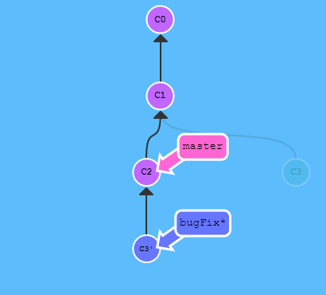
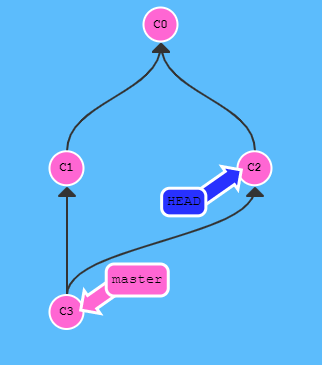
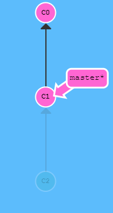
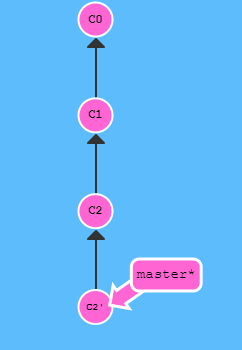
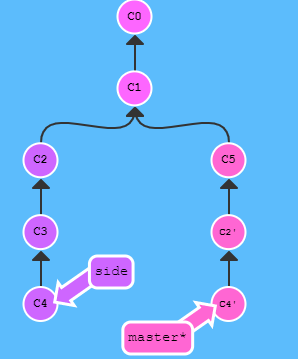
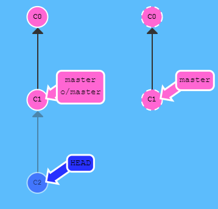
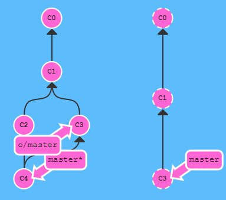
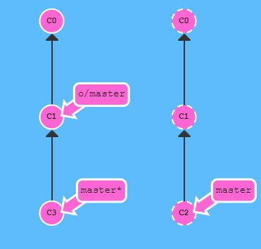
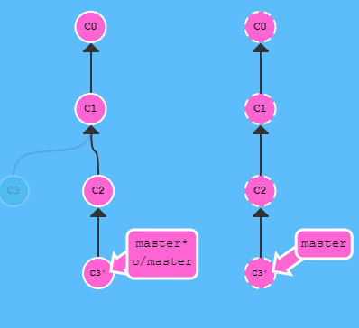
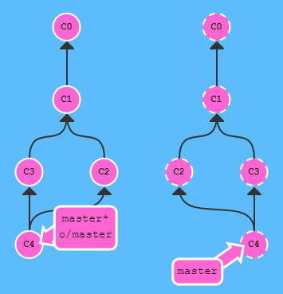

# Git命令用法小结
* # commit
	* 每次的commit，看做是对上一次的继承。自底往上看，比较好理解git的工作方式。

* # merge
	* `git merge bugFix`: 会把bugFix分支合并到**当前分支**。
* # rebase
	* `rebase` 实际上就是取出一系列的提交记录，“复制”它们，然后在另外一个地方逐个的放下去。
	* 如图所示，`git rebase master`会把当前bugFix分支移到master分支上，得到一个**线性**的提交序列。
	* `git rebase -i HEAD~4`，交互式调整前四个提交记录。
	* `git rebase caption master`，使得master快速前进到caption，并且使得当前分支指向master。

* # HEAD
	* HEAD 通常情况下是指向分支名的，HEAD -> master。当执行checkout 哈希值时，会分离HEAD，**注意**：master是不动的。
	* 使用` ^` 向上移动 1 个提交记录；使用 `~<num>`向上移动多个提交记录，如 `~3`
	* 当master继承两个父提交时，master^等于master的一个父提交；master^2等于另一个父提交。如图`git checkout master^2`，HEAD^1/HEAD^2一样的效果。

* # branch
	* 强行移动分支用`-f`，如`git branch -f master HEAD~3`，使得master分支强制指向前三个父提交。

* # 两种撤销方式
* ## reset
	* `reset`是通过**直接**回退提交记录来实现撤销。如图`git rest HEAD~1`
	* 该回退方式对远程分支无效。

* ## revert
	* `revert`通过一次**新提交**来回退。如图`git revert HEAD`，注意这里是HEAD不是HEAD~1。提交后的C2'与C1状态一样。
	* 可以使远程厂库发现回退。

* # cherry-pick
	* `git cherty-pick <哈希值>...`：可以把一些提交复制到当前所在的位置（HEAD）。
	* 如图`git cherry-pick C2 C4`

* # tag
	* `git tag V1 哈希值`，打标签。
	* `git describe <ref>`: `<ref>`是一个提交记录引用，输出的结果是`<tag>_<numCommits>_g<hash>`：tag 表示的是离 ref 最近的标签， numCommits 是表示这个 ref 与 tag 相差有多少个提交记录， hash 表示的是你所给定的 ref 所表示的提交记录哈希值的前几位。
	
	

# 远程相关

* # clone
	* `git clone`会使得本地厂库多了一个名为`origin/master`的远程分支。
	* 在checkout远程分支时，会直接分离HEAD，这样使得你的新提交不会更新。如图`git checkout o/master; git commit`所示：

* # fetch
	* `git fetch`做了两件事：
		1. 从远程仓库下载本地仓库中缺失的提交记录。
		2. 更新远程分支指针(如 o/master)。
	* 实际上将本地仓库中的**远程分支**更新成了远程仓库相应分支最新的状态，但不更改**本地master**状态，不会修改磁盘文件。可以将`git fetch`的理解为单纯的下载操作。

* # 带参数fetch
	* `git fetch origin foo`：把远程foo拉到本地不存在的o/foo。更新的是本地o/分支。
	* `git fetch origin <source>:<destination>`：soruce指的是远程，destination指的是本地。这个命令可以直接更新本地分支。
	* `git fetch origin :bar`，source为空，会在本地创建一个新分支。

* # pull
	* ·`git pull`是git fetch + git merge，注意是merge到**当前分支**，非`o/master`。
	* `git pull --rebase`:fetch和rebase结合，rebase到当前分支。

* # 带参数pull
	* `git pull origin foo` 相当于：`git fetch origin foo; git merge o/foo`
	* `git pull origin bar~1:bugFix` 相当于：`git fetch origin bar~1:bugFix; git merge bugFix`
	* `git pull` 实际上就是 fetch + merge 的缩写, 唯一关注的是提交最终合并到哪里（也就是为 git fetch 所提供的 destination 参数）

* # push
	* 更新本地master到远程master，同时同步本地`origin/master`分支到本地master上。
	* 当本地`origin/master`与远程master不同步时，无法push。可以把本地`origin/master`与远程master看作是**同步游标**，需要保持同步，才能push。解决方法有两种:
		1. 先fetch在rebase。如图所示`git fetch; git rebase o/master;git push`等于`git pull --rebase;git push`:  变成：
		2. 先fetch在merge。如图所示`git fetch; git merge o/master;git push`等于`git pull; git push`:  变成：

* # 带参数的push: 
	* `git push <remote> <place>`，如`git push origin master`，意思是切到本地仓库中的“master”分支，获取所有的提交，再到远程仓库“origin”中找到“master”分支，将远程仓库中没有的提交记录都添加上去。通过“place”参数来告诉 Git 提交记录来自于 master, 要推送到远程仓库中的 master。它实际就是要同步的两个仓库的位置，所以会忽略目前所在分支的位置。
	* `git push origin <source>:<destination>`：要是推送到的目的分支不存在会自动创建。
	* `git push origin :foo`: 若source字段为空，删除远程foo分支。

* # 追踪分支
	* `git checkout -b newMaster o/master`，先建追踪远程分支。或在当前分支上运行`git branch -u o/master`。

# 《git图文教程及详解》
* # 版本回退
	1. `git log –pretty=oneline`简要查看git历史的命名。
	2. `git reset –hard HEAD^(或版本号)`
* # 撤销修改
`git checkout -- 文件`， 撤销有两种情况：
	
1. 文件修改后，还没有放到暂存区，使用撤销修改就回到和版本库一模一样的状态。
2. 文件修改后已经放入暂存区了，接着又作了修改，撤销修改就回到添加暂存区后的状态。

* # 远程相关
* 将本地仓库与远程仓库关联：`git remote add origin 远程地址`
* 推送到远程仓库：`git push -u origin master`。由于远程库是空的，首次推送master分支时，加上了–u参数，Git不但会把本地的master分支内容推送的远程新的master分支，还会把本地的master分支和远程的master分支关联起来。

* # 分支相关
* 相关命令：
	* 查看分支：git branch
	* 创建分支：git branch name
	* 切换分支：git checkout name
	* 创建+切换分支：git checkout –b name
	* 合并某分支到当前分支：git merge name
	* 删除分支：git branch –d name
* 合并分支时，git默认使用fast forward模式， 在这种模式下，删除分支后，会丢掉分支信息。所以可以使用带参数的merge，如`git merge –no-ff -m “注释” dev`
* bug分支：
	1. 先在dev分支使用`git stash`保存现场，
	2. 切换到master分支，然后创建bug临时分支，修复bug。
	3. 切换到master分支合并bug分支，并删除bug分支。
	4. 切换到dev分支，使用`git stash pop`恢复现场。
* 多人协作
	1. 要查看远程库的信息 使用 `git remote`/`git remote –v`
	2. 推送dev分支，`git push origin dev`。
	3. 那么一般情况下，那些分支要推送呢？（1）master分支是主分支，因此要时刻与远程同步。（2）一些修复bug分支不需要推送到远程去，可以先合并到主分支上，然后把主分支master推送到远程去。
* 抓取分支：
	1. 在本地拉取远程的dev分支：`git checkout –b dev origin/dev`，然后进行修改与push。
	2. 若其他人也修改了dev分支，则需要先pull分支进行冲突修改，然后再push。
